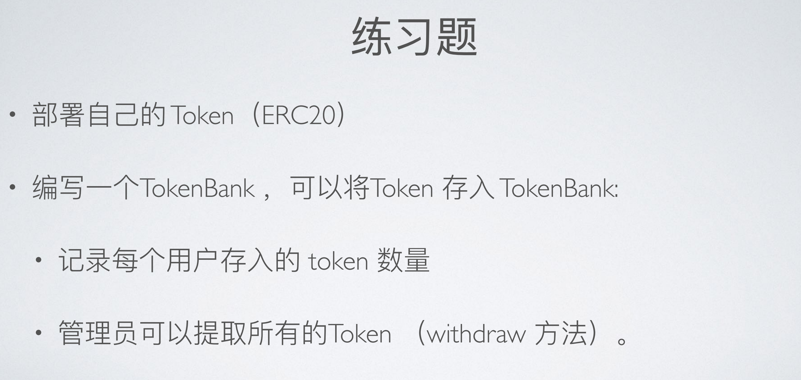

# 练习题（01.12）



## ERC20Token 合约

### Token Metadata：

**Token Name**：Garen Test Token

**Token Symbol**：GTT

**Token Decimal**：18

### 合约代码：

```solidity
// SPDX-License-Identifier: MIT
pragma solidity ^0.8.0;

import "@openzeppelin/contracts/token/ERC20/ERC20.sol";
import "@openzeppelin/contracts/token/ERC20/extensions/ERC20Permit.sol";
import "@openzeppelin/contracts/utils/ReentrancyGuard.sol";
import "@openzeppelin/contracts/utils/Address.sol";

contract ERC20TokenGTT is ERC20, ERC20Permit, ReentrancyGuard {
    using Address for address;
    address private owner;
    error NotOwner(address caller);
    event TokenMinted(uint amount, uint timestamp);

    constructor() ERC20("Garen Test Token", "GTT") ERC20Permit("Garen Test Token") {
        owner = msg.sender;
        /// @dev Initial totalsupply is 100,000
        _mint(msg.sender, 100000 * (10 ** uint256(decimals())));
    }

    modifier onlyOwner() {
        if (msg.sender != owner) {
            revert NotOwner(msg.sender);
        }
        _;
    }

    function mint(address _recipient, uint _amount) external onlyOwner {
        _mint(_recipient, _amount);
        emit TokenMinted(_amount, block.timestamp);
    }
}
```


## TokenBank 合约

TokenBank 合约除了满足练习题中的要求外，还实现了“根据用户在 TokenBank 合约中存储 GTT 金额的多少进行前 3 排名”的功能。

- tokenBalance 变量：是用户地址到用户 token 余额的映射，记录用户在本合约中存储的 token 数量。
- withdrawToken 方法：仅允许 owner 使用，将本合约中的 token 余额全部转给 owner（即“卷款跑路” :-P ）。

```solidity
// SPDX-License-Identifier: MIT
pragma solidity ^0.8.0;

import "./Bank.sol";

interface IERC20TokenGTT {
    function transferFrom(address, address, uint256) external returns (bool);

    function balanceOf(address) external view returns (uint256);

    function transfer(address, uint256) external returns (bool);
}

contract TokenBank is Bank {
    mapping(address => uint) internal tokenBalance;
    address[3] internal tokenRank;
    address public tokenAddr;
    IERC20TokenGTT public IGTT;
    error TokenTransferFail(uint transferredAmount, uint tokenBalance);

    constructor(address _tokenAddr) {
        tokenAddr = _tokenAddr;
        owner = msg.sender;
        IGTT = IERC20TokenGTT(tokenAddr);
    }

    function depositToken(uint _tokenAmount) public {
        bool transferSuccess = IGTT.transferFrom(
            msg.sender,
            address(this),
            _tokenAmount
        );
        if (!transferSuccess)
            revert TokenTransferFail(_tokenAmount, IGTT.balanceOf(msg.sender));
        tokenBalance[msg.sender] += _tokenAmount;
        _handleRankWhenDepositToken();
    }

    function withdrawToken() public onlyOwner {
        IGTT.transfer(owner, IGTT.balanceOf(address(this)));
    }

    function getTokenBalance(address _account) public view returns (uint) {
        return tokenBalance[_account];
    }

    function getTokenTopThreeAccount()
        public
        view
        returns (address, address, address)
    {
        return (tokenRank[0], tokenRank[1], tokenRank[2]);
    }

    function _handleRankWhenDepositToken() internal {
        uint membershipIndex = _checkTokenRankMembership();
        uint convertedIndex;
        uint indexRecord = 777;
        if (membershipIndex != 999) {
            // Case 1: msg.sender is already inside the top3 rank.
            convertedIndex = membershipIndex + 4;
            for (uint i = convertedIndex - 3; i > 1; i--) {
                if (membershipIndex != 0) {
                    if (
                        tokenBalance[msg.sender] >
                        tokenBalance[tokenRank[i - 2]]
                    ) {
                        indexRecord = i - 2;
                        for (uint j = 2; j > i - 2; j--) {
                            tokenRank[j] = tokenRank[j - 1];
                        }
                        // Boundry condition
                        if (indexRecord == 0) {
                            tokenRank[indexRecord] = msg.sender;
                        }
                    } else {
                        if (indexRecord != 777) {
                            tokenRank[indexRecord] = msg.sender;
                        }
                    }
                }
            }
        } else {
            // Case 2: msg.sender is not inside the top3 rank.
            for (uint i = 3; i > 0; i--) {
                if (tokenBalance[msg.sender] > tokenBalance[tokenRank[i - 1]]) {
                    indexRecord = i - 1;
                    // move backward the element(s) which is(/are) right at the index and also behind the index
                    for (uint j = 2; j > i - 1; j--) {
                        tokenRank[j] = tokenRank[j - 1];
                    }
                    // Boundry condition
                    if (indexRecord == 0) {
                        tokenRank[indexRecord] = msg.sender;
                    }
                } else {
                    if (indexRecord != 777) {
                        tokenRank[indexRecord] = msg.sender;
                    }
                }
            }
        }
    }

    function _checkTokenRankMembership() internal view returns (uint) {
        uint index = 999;
        for (uint i = 0; i < 3; i++) {
            if (tokenRank[i] == msg.sender) {
                index = i;
                break;
            }
        }
        return index;
    }
}
```

### Bank 合约（TokenBank 合约的父类）：

```solidity
// SPDX-License-Identifier: MIT
pragma solidity ^0.8.0;

contract Bank {
    // To protect personal privacy, some of the variables are set internal.
    // To get those values of variables, set getter-functions to get users' values by their own instead of being queried by anyone.
    mapping(address => uint) internal ETHBalance;
    address[3] internal rank;
    address public owner;

    constructor() {
        owner = msg.sender;
    }

    modifier onlyOwner() {
        require(msg.sender == owner, "Only owner can call");
        _;
    }

    function depositETH() public payable {
        ETHBalance[msg.sender] += msg.value;
        _handleRankWhenDepositETH();
    }

    receive() external virtual payable {
        depositETH();
    }

    function withdrawETH() public onlyOwner {
        payable(owner).transfer(address(this).balance);
    }

    function getETHBalance(address _account) public view virtual returns (uint) {
        return ETHBalance[_account];
    }

    function getETHTopThreeAccount()
        public
        view
        returns (address, address, address)
    {
        return (rank[0], rank[1], rank[2]);
    }

    function _handleRankWhenDepositETH() internal {
        uint membershipIndex = _checkETHRankMembership();
        uint convertedIndex;
        uint indexRecord = 777;
        if (membershipIndex != 999) {
            // Case 1: msg.sender is already inside the top3 rank.
            convertedIndex = membershipIndex + 4;
            for (uint i = convertedIndex - 3; i > 1; i--) {
                if (membershipIndex != 0) {
                    if (ETHBalance[msg.sender] > ETHBalance[rank[i - 2]]) {
                        indexRecord = i - 2;
                        for (uint j = 2; j > i - 2; j--) {
                            rank[j] = rank[j - 1];
                        }
                        // Boundry condition
                        if (indexRecord == 0) {
                            rank[indexRecord] = msg.sender;
                        }
                    } else {
                        if (indexRecord != 777) {
                            rank[indexRecord] = msg.sender;
                        }
                    }
                }
            }
        } else {
            // Case 2: msg.sender is not inside the top3 rank.
            for (uint i = 3; i > 0; i--) {
                if (ETHBalance[msg.sender] > ETHBalance[rank[i - 1]]) {
                    indexRecord = i - 1;
                    // move backward the element(s) which is(/are) right at the index and also behind the index
                    for (uint j = 2; j > i - 1; j--) {
                        rank[j] = rank[j - 1];
                    }
                    // Boundry condition
                    if (indexRecord == 0) {
                        rank[indexRecord] = msg.sender;
                    }
                } else {
                    if (indexRecord != 777) {
                        rank[indexRecord] = msg.sender;
                    }
                }
            }
        }
    }

    function _checkETHRankMembership() internal view returns (uint) {
        uint index = 999;
        for (uint i = 0; i < 3; i++) {
            if (rank[i] == msg.sender) {
                index = i;
                break;
            }
        }
        return index;
    }
}
```


## 合约部署与验证


### ERC20Token（“GTT”）合约：

**地址**：0xF2f3749E71103b13e6c8f62B26a666d8Dc6A14A9

**total supply（初始）**：100000*10**18

**owner**：0x9314f15a04d9a69bCE94758e535e49c4e6c6770E

https://goerli.etherscan.io/address/0xF2f3749E71103b13e6c8f62B26a666d8Dc6A14A9


### TokenBank 合约：

地址：0x70B4eE1a45129008a0e7079F87cF6401fcDd96c9

**owner**：0x9314f15a04d9a69bCE94758e535e49c4e6c6770E

https://goerli.etherscan.io/address/0x70B4eE1a45129008a0e7079F87cF6401fcDd96c9
